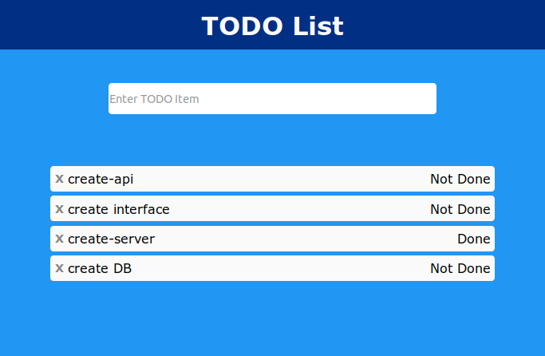

# TODO Fullstack App (Go/Gin/Postgres/React)


This fullstack application creates a **TODO List Web Page** using the **Go/Gin/Postgres/React** stack.



---

## 🚀 Starting the Application

In the project root, run:

```sh
docker-compose build
docker-compose up
```

---

## 🏗️ Backend - Go Server

The **Go** server is responsible for:

- Spinning up the backend.
- Defining API routing.
- Interacting with the database.

---

## 🔄 Gin Router

The **Gin** framework is used to define the TODO API with the following functionality:

1. **List** all TODO items.
2. **Create** a new TODO item and add it to the database.
3. **Update** a TODO item (mark as completed).
4. **Delete** a TODO item from the database.
5. **Filter** TODO items (future enhancement).

---

## 🗄️ Postgres Database

The **Postgres** database is used to store TODO items, structured as:

- `id` (unique identifier)
- `item_text` (text of the TODO item)
- `done` (boolean to indicate completion status)

---

## 🎨 Frontend - React

The **React** frontend is responsible for:

- Creating a fully responsive client-side application.
- Using components to build the UI efficiently.
- Communicating with the backend API for data operations.

---
